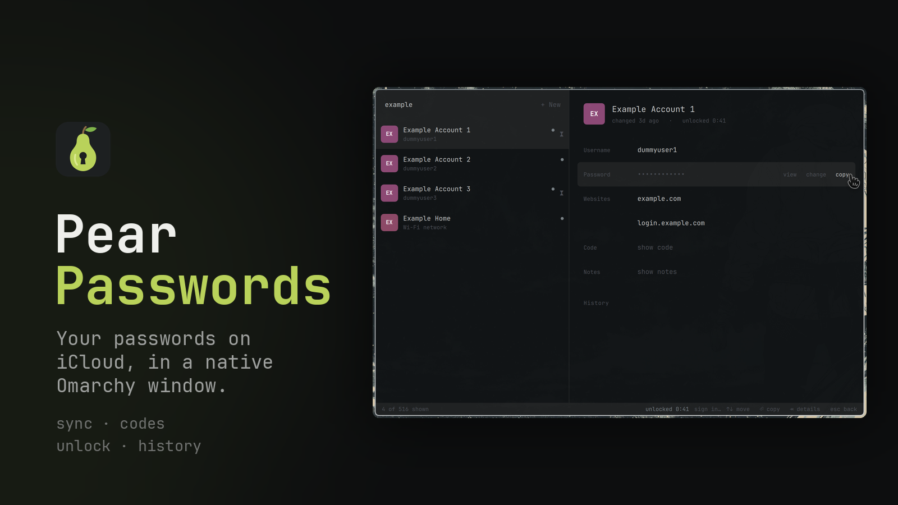
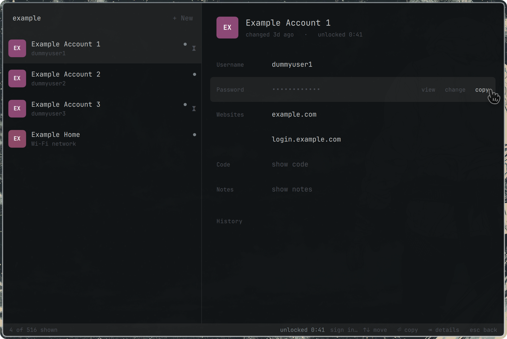

# Pear Passwords

Your passwords on iCloud, in a native Omarchy window.



Sign in with your Apple Account, approve this computer once, and your passwords and
verification codes stay in sync.

 The window follows your Omarchy theme and is built from
Omarchy's own shell components.

> Pear Passwords is an independent project. It is not made, endorsed or supported by Apple.
> iCloud and Apple Account are Apple's trademarks, used here only to say
> what this works with.

## What it does

- **Your passwords on iCloud, synced.** It signs in as a Mac would and is approved as one of
  your devices once. While Pear is open and unlocked it syncs when you unlock, every two hours
  and when you ask. Apple should not ask for a code again unless it signs you out.
- **Locked until you say so, one account at a time.** Opening Pear shows one dialog, with your
  fingerprint or password, and only then the list of accounts. Revealing, copying or changing
  one account's password asks once more, naming that account.
- **Click to copy.** Username, password, website and verification code. A copied password is
  gone from the clipboard after one paste, or after 30 seconds.
- **Add passwords.** **+ New** saves a login to iCloud, with a generated password if you want
  one, and optional notes and verification code.
- **Edit what Apple stores.** Extra websites, notes and verification codes. Set up a code by
  pasting the setup key or link, and see the live code before you save.
- **Password history.** Changes seen during sync are kept, alongside the history Apple stores.
- **Change a password, one at a time.** Writes back to iCloud, so your other devices get it.
  Each change is written and read back on its own; nothing rewrites your passwords in bulk.
- **Strong, memorable passwords.** The generator uses the same six-six-six shape as Apple's.
- **Names that sync.** Rename an entry here and the name shows up on your other devices too.
- **Wi-Fi passwords.** Your saved networks, shown as networks rather than websites.
- **Search that understands what you want.** Type a name or site, or one of these to filter:

  | Search | Shows |
  | --- | --- |
  | `2fa`, `mfa`, `2fa codes`, `verification codes` | entries with a verification code |
  | `notes` | entries with notes |
  | `websites` | entries with a website |
  | `wifi` | Wi-Fi networks |

- **Keyboard first.** Arrows to move, Tab into the details, Enter to copy, Esc to go back.
- **Browser autofill, if you want it.** Off by default. Turn it on in the window, bring your own
  extension and register it with one command; every fill asks first. See
  [Autofill](#autofill-bring-your-own-extension).

## How unlocking works

Pear 2.0 keeps every key in a small system service, `pear-passwordsd`, which runs as its own
user (`pear-passwords`), not as you. Nothing in your home directory can decrypt your passwords,
and no program running as you can talk to the service: only the Pear window can, plus browser
autofill hosts once you turn autofill on in the window. While autofill is on, any program
running as you can connect the way a browser does; it still gets a password only if you approve
that fill's dialog (see [Autofill](#autofill-bring-your-own-extension)).

You see two kinds of dialog, both drawn by Omarchy's own polkit agent, and nothing else ever
asks for a password:

| Action | The dialog says | When |
| --- | --- | --- |
| `io.github.dragosol.pearpasswords.unlock` | Unlock Pear Passwords to show your accounts | Each time you open Pear, and after it locks |
| `io.github.dragosol.pearpasswords.reveal` | Use the saved password for $(account) | The first reveal, copy, code, notes, history or edit of one account |
| `io.github.dragosol.pearpasswords.manage` | Change Pear Passwords on this computer | Signing in or out, adding or deleting, moving from 1.x, starting over, deleting the old 1.x copy, checking clipboard history, turning browser autofill on, moving your keys onto the security chip |
| `io.github.dragosol.pearpasswords.autofill` | A browser extension asks to fill the password for $(account) on $(origin) | Every browser fill, if you set up autofill |

1. **Opening Pear** asks once. Approving releases the list of accounts: names, sites and
   usernames, never a password. The list shows straight away from the last sync, with "synced
   N min ago", and a fresh sync replaces it.
2. **One account** asks again, with that account's name in the dialog. Approving opens just
   that account for **2 minutes** (the status bar counts down from 2:00). Selecting another
   account closes it at once. Copying a username or a website never asks.
3. **A revealed password** shows for at most 20 seconds, or until the window loses focus.

Each dialog takes your fingerprint first. The password field appears if the reader times out
(about 30 seconds) or fails, or straight away when the lid is closed. A dialog is never
remembered: there is no "keep me authorized for 5 minutes" behind any of them. A wrong
password in a Pear dialog counts toward your account's failed-login limit like any other
(`pam_faillock`: three in a row lock the account for ten minutes on Arch).

**Pear locks** when you close the window, press **Lock**, suspend, or log out, and every key is
wiped from memory before the machine sleeps or the session ends. **Locking the screen with
Omarchy's lock does not lock Pear yet:** Omarchy's lock tells logind nothing (no `Lock`, no
`LockedHint`), and the fallback that would forward it is not built (gate G6). Press **Lock** or
close the window before you walk away, or turn on idle locking. On desktops whose locker
calls `loginctl lock-session` or sets `LockedHint`, locking the screen locks Pear too. Locking
after a period of inactivity is off by default; Settings offers 5, 15 or 30 minutes. After a
lock nothing asks again until you click **Unlock**.

Settings also change how long an account stays open (0 to 10 minutes; 0 means it closes after
one use) and how long a copy stays on the clipboard (5 to 60 seconds).

## Install

```bash
omarchy plugin add https://github.com/dragosol/omarchy-pear-passwords.git --enable
cd ~/.config/omarchy/plugins/io.github.dragosol.pear-passwords
./install.sh
```

`install.sh` runs as you. It builds the sign-in helper, stages exactly the files the system
step needs (and the hash-locked Python wheels) in `~/.cache/pear-passwords/stage`, and prints
one command for you to run with sudo:

<!-- pinned: tools/gen-sha256sums.sh keeps the hash below equal to sha256(SHA256SUMS) -->
```sh
sudo sh -c 'set -eu; h=$(getent passwd "${SUDO_USER:?run this with sudo}" | cut -d: -f6); s=$(mktemp -d /root/pear-stage.XXXXXX); trap "rm -rf \"$s\"" EXIT; cp -rT --no-preserve=all "$h/.cache/pear-passwords/stage" "$s"; cd "$s"; echo "581e8630ab20c7467c73ec590d129f9d7f86ed90f432ef415dd91f25b71e4c57  SHA256SUMS" | sha256sum -c --strict --quiet; sha256sum -c --strict --quiet SHA256SUMS; sh ./system/install-root.sh "$s"'
```

The command copies the stage into a fresh directory only root can write, checks that its
`SHA256SUMS` has the hash above, checks every staged file against `SHA256SUMS`, and runs
`system/install-root.sh` from that copy. **Check the hash against the
[release notes](https://github.com/dragosol/omarchy-pear-passwords/releases) for your
version**: it is what proves that what root installs is the reviewed code, and the copy in this
README is only as trustworthy as your checkout. The command never downloads anything; the
wheels are checked by pip against `backend/requirements.lock`, which `SHA256SUMS` covers.

Then search **Pear Passwords** in the launcher.

The system step installs, and records in a receipt (`/var/lib/pear-passwords-install`):

| What | Where |
| --- | --- |
| The service and its Python environment (offline, hash-locked) | `/usr/local/lib/pear-passwords/venv` |
| The window (Quickshell) | `/usr/local/lib/pear-passwords/app` |
| `pear-exec`, the only way to reach the service, compiled from `native/pear-exec.c` | `/usr/local/lib/pear-passwords/libexec/` |
| The autofill host wrapper (does nothing until you register a browser) | `/usr/local/lib/pear-passwords/libexec/pear-autofill-host` |
| The opt-in autofill registration command | `/usr/local/bin/pear-passwords-autofill` |
| The socket and service units | `/etc/systemd/system/pear-passwordsd.{socket,service}` |
| The root seal service, a fallback installed but never enabled unless `pear-passwordsd.service` sets `PEAR_SEAL_BACKEND=seal-service`; it runs `systemd-creds` as root for the service's own keys only (docs/security.md, G1) | `/etc/systemd/system/pear-passwords-seal.socket`, `pear-passwords-seal@.service` |
| The rule that creates the vault directory | `/etc/tmpfiles.d/pear-passwords.conf` |
| The installed version and the hash of its `SHA256SUMS` | `/usr/local/lib/pear-passwords/VERSION` |
| The window's system-only font configuration and the root uninstaller | `/usr/local/lib/pear-passwords/etc/fonts.conf`, `/usr/local/lib/pear-passwords/libexec/uninstall-root` |
| The four polkit actions | `/usr/share/polkit-1/actions/io.github.dragosol.pearpasswords.policy` |
| The `pear-passwords` user and the empty `pear-client` group | `/etc/sysusers.d/pear-passwords.conf` |
| Your vault, readable only by `pear-passwords` | `/var/lib/pear-passwords/u<uid>/` |
| The launcher | `/usr/local/share/applications/io.github.dragosol.PearPasswords.desktop` |

It writes a path only if it is free or holds exactly a file Pear installed there. If anything
else is in the way (an edited unit, a same-named unit elsewhere, a drop-in directory, another
policy declaring Pear's actions, a `pear-client` group with members) it changes nothing and
lists what to move. It removes the 1.x polkit action only if it is byte-for-byte a copy 1.x
handed out. It never runs pacman; it needs `gcc` to compile `pear-exec`.

Requires `python3`, `podman`, `quickshell`, `gcc` and Omarchy's shell. After
`omarchy plugin update`, run `./install.sh` again and then the command it prints. The same
command upgrades in place and never touches your vault. A Python minor upgrade (3.14 to 3.15)
makes the service stop with a message in the window: re-run the same two steps.

`install.sh` also retires what 1.x put in your home, each file only if it is exactly what 1.x
wrote: the 2-hourly sync timer (2.0 syncs inside the service), the 1.x launcher once the 2.0
one exists, and the 1.x backend in `~/.local/share/pear-passwords` once your passwords have
moved into 2.0. Anything you changed is listed and kept.

### Opening it

Pear Passwords is a standalone app, not a panel in Omarchy's bar. Open it from the launcher
like any other app: search **Pear Passwords**. It runs as its own window on purpose, because
plugins inside the shell share one QML scene and can reach each other's objects, which is no
place for decrypted passwords.

### First sign-in

On a computer that never had 1.x, the first launch opens straight into sign-in, after one
dialog:

1. **Apple Account and password**, typed into the Pear window.
2. **Verification code**, sent to your other Apple devices.
3. **Approve this computer.** Pick one of your devices and enter its **lock-screen passcode**
   (iPhone, iPad) or **login password** (Mac). This is how Apple lets a new device read your
   passwords without another device approving it.

These are Apple's credentials, used only to sign in. They never unlock Pear.

> [!WARNING]
> Step 3 is the one step that can't be undone. Apple allows about 10 wrong passcode attempts per
> device. After the 10th, Apple permanently destroys that device's escrow record, and it can no
> longer be used to add new devices. Your passwords on devices that already trust you are not
> affected. The app shows this warning before you type, and **Not now** backs out without
> spending an attempt.

## Migrating from 1.x

Your 1.x vault in `~/.config/icp` is moved into 2.0 once, when you say so. It keeps your
history and nicknames, and it does not sign this computer in again.

> **If 1.x never asked you for a passphrase**, its key is in your login keyring (1.x's
> default). There is then nothing to type: Pear reads the key from the keyring (the item
> 1.x saved, `application=icp`), checks it against the vault itself, and moves it. If the
> keyring is locked, the window says **Unlock your login keyring**; clicking **Unlock
> keyring** brings up the keyring's own unlock dialog (the desktop's, not Pear's). If the
> key is not in the keyring at all, the window says so and nothing changes; **Start fresh
> instead** signs this computer in to iCloud again, without the 1.x history and nicknames,
> and leaves `~/.config/icp` where it is. No terminal step either way.

> **For the smoothest move, open and unlock Pear Passwords 1.3.2 within 15 minutes before this
> step.** 2.0 then asks 1.3.2's background agent for the key, and you type nothing.

1. Unlock 1.3.2, then run `./install.sh` and the root command it prints. The install never
   touches `~/.config/icp`, and 1.3.2's background agent keeps running.
2. Open Pear Passwords 2. It shows **Move your passwords into Pear Passwords 2**, says what
   will change, and lists the 1.x background services it will stop.
3. Click **Continue**. One dialog. For a passphrase vault, if 1.3.2 was not unlocked recently
   and the keyring holds no copy of its key, the window asks for your old passphrase, this one
   last time, in a field inside the Pear window. A wrong passphrase just asks again; nothing
   changes until it is right. That field is the only password Pear ever asks for itself.
4. Pear converts everything, re-opens what it wrote and compares counts and a checksum with
   what it read. Only on an exact match does it take over: it stops 1.3.2's agent, removes the
   1.x key files and the keyring entries, stops and disables the 1.x units (`icp-host`,
   `icp-sync`, `pear-passwords-sync`; any it could not stop are listed with the command to
   run), renames `~/.config/icp` to `~/.config/icp.v1-backup-YYYYMMDD`, and removes the 1.x
   launcher and its backend in `~/.local/share/pear-passwords` (the launcher only if it is
   unchanged). On any mismatch nothing is kept and 1.x stays as it was.
   If you close the window before this step finishes (for example to go and unlock 1.3.2),
   the next time you open Pear it offers the move again; it does not sign in afresh.
5. If you used 1.x's browser autofill: with the checkbox on the migration screen, the old
   `org.icp.native.json` manifests (only those that point at the 1.x host) are moved into the
   backup. `~/icp` itself is never touched. The new host is **not** registered for you; the
   screen shows the one command to do that (see [Autofill](#autofill-bring-your-own-extension)).

**Afterwards.** Settings offers **Delete the old encrypted copy** after the first good sync. It
asks once, then deletes exactly the files it moved, and only if they are unchanged.

**Rollback.** Until you delete the old copy: rename `~/.config/icp.v1-backup-YYYYMMDD` back to
`~/.config/icp` and reinstall 1.3.2.

**Old backups.** Copies of `~/.config/icp` in backups or snapshots stay encrypted with your old
passphrase, with no key beside them. Anyone who guesses that passphrase can still open them.
If it was weak, change the passwords that matter.

## Autofill (bring your own extension)

Pear does not ship a browser extension: a plugin that bundles one that is not on
addons.mozilla.org could not be reviewed with it. What Pear ships is a generic native-messaging
host, `io.github.dragosol.pearpasswords`, which any extension can talk to. The message format
is in [docs/autofill-protocol.md](docs/autofill-protocol.md).

It is **off by default**, in two places. First turn it on in the Pear window: Settings,
"Browser autofill", **On** (one dialog; **Off** never asks and disconnects every browser at
once). Until then the service refuses every autofill host, whatever is registered.
No installer writes a browser manifest, so then register it for one browser, with the id of
the extension you use:

```bash
pear-passwords-autofill register --browser zen --extension-id <id>
pear-passwords-autofill unregister --browser zen     # turn it off again
pear-passwords-autofill unregister --all
```

`register` supports `zen`, `firefox`, `librewolf`, `chromium` and other Firefox and Chromium
family browsers (`pear-passwords-autofill --help` lists them). It writes the manifest into that
browser's directory in your home and records its hash; `unregister` removes only a manifest
whose hash still matches, and `./uninstall.sh` runs `unregister --all` for you.

How a fill works:

- It works only while the Pear window is open and unlocked. While Pear is locked the host
  answers only "locked", and says nothing about which sites have accounts.
- **Every fill shows its own dialog**: "A browser extension asks to fill the password for
  GitHub — me on github.com". No approval carries over to the next fill, and the browser never
  gets the window's open account.
- Until a fill through it has been approved, a browser connection learns which accounts exist
  for a site only as opaque ids, not their usernames.
- The account must match the site: the same host, or a subdomain or parent domain of a website
  saved with the account. Lookalike and public-suffix matches (`co.uk`, `github.io`) never
  count.
- Fills are rate-limited like the window's dialogs: one at a time, and after three dismissed
  or denied fill dialogs in a minute, no more for the rest of it; the browser's dialogs never
  block the window's.
- Only `https://` pages.

What to know before you turn it on:

- **Any program running as you can then ask the way your browser does.** The host program is
  set-gid so that only it can reach the service, but anything of yours can start it. Such a
  program still gets nothing without a dialog, and the dialog says a browser extension is
  asking; but if you approve a fill you did not just ask your browser for, it gets that
  password. Before you approve one, it learns only how many accounts a site has, as opaque
  handles that change every time Pear locks, never a username, and it cannot test a guessed
  one. The window shows when an autofill host is connected. Leave autofill off if you do not
  use it.
- **The browser then holds that password**, and so does the extension. Pear's protection ends
  where the browser's begins.
- **The site is only as trustworthy as the browser that reports it.** A well-behaved extension
  takes it from the browser's tabs API, never from the page, and fills only after you click
  or press its shortcut, never on page load. Use an extension you trust to do that.

## Clipboard

- A copied password, code or note is offered for **one paste**, then withdrawn. If nothing
  pastes it, it is withdrawn after **30 seconds** (Settings: 5 to 60). Withdrawing clears the
  clipboard only if your copy is still what is on it, so something you copied since is safe.
- Omarchy's clipboard history is told nothing: Pear recognises its watcher and gives it no
  data. Copies are also marked with `x-kde-passwordManagerHint`, which only *asks* other
  history managers not to keep them.
- The value never passes through a file: it is held in memory by a small Wayland clipboard
  writer, never `wl-copy`, which stages its input in `/tmp`.
- The Copy buttons are the only way a secret reaches the clipboard. Ctrl+C, Ctrl+X and the
  right-click menu do nothing in the fields where you type or edit a password, notes or a
  setup key.
- While a copy is on offer, any program that can read your clipboard can read it. If one reads
  it first, your own paste comes up empty, which at least tells you.
- Settings can check your clipboard history for passwords copied by older versions (it asks
  first and shows only a count) and points you at Omarchy's clipboard panel to remove them.

## Sync

Sync runs inside the service, **only while Pear is open and unlocked**: right after you unlock,
every two hours while it stays open, and when you press **Sync**. A locked computer does not
sync; that is the price of "nothing decryptable until you approve". There is no background
timer and nothing in the background ever shows a dialog.

Sync never needs the key that opens passwords: it writes new passwords with a public key and
notices changes by a keyed checksum. The sign-in helper runs on `127.0.0.1:6969`; if it is
down, sync says "anisette unavailable" and the list stays as it was.

## TPM (the security chip)

Pear seals its two keys with `systemd-creds`: today with the computer's host key, and
automatically with the TPM as well once one is present (on Intel laptops, "PTT" in the BIOS;
the firmware must boot in UEFI mode, which exposes the TPM to Linux).
After you turn PTT on, Settings offers **Move your keys onto the security chip** (one dialog;
Pear never does it on its own). It moves the vault to **new** keys sealed with the TPM:
everything is re-encrypted inside Pear's service, checked to read back, swapped in at once, and
the old keys are deleted. This is the one time Pear's service opens every password at once
without a dialog per account, which is why it waits for your click. No PCRs and no TPM PIN are
used, so firmware, bootloader and kernel updates never lock you out.

Pear checks what every new key blob is actually sealed to and accepts only the key types it
has seen a real TPM produce (systemd 261 and 262: host key, or host key plus TPM). Anything
else is refused and nothing is saved:

- **A `tpm2-pcr-public-key.pem`** (a signed UKI setup): with a TPM present, `systemd-creds`
  would tie new keys to that signed boot policy, and a boot without a matching signature
  (another kernel, a fallback entry) could never open them. Pear does not seal anything that
  way. A vault that is already host-sealed stays host-sealed and keeps working. A **new**
  vault (first setup, the move from 1.x, Start over) cannot be created on such a computer:
  the window says "this computer has a signed boot policy" and nothing is saved. Removing the
  PEM makes setup work.
- **A key type Pear does not know** (a future systemd that changes them): the same refusal,
  with its own message, until Pear is updated.

**What turning PTT on buys:** a copy of the whole disk, or a backup of `/`, taken after the
switch can no longer decrypt your passwords on another machine. Without it, the host key is in
that same image. A backup taken **before** the switch still decrypts what was in the vault at
that time (and the Apple sign-in tokens it held), forever: delete those snapshots. It does not
protect against root or malware on the running laptop, or against someone who has both the
laptop and your disk passphrase. It changes nothing about booting.

**What it costs:** clearing the TPM in the BIOS, turning PTT off again, or replacing the board
makes the keys unrecoverable. Pear then says so and offers **Start over** (sign in to iCloud
again; local history and nicknames are lost). Turning PTT off by mistake is not that: Pear says
"turn it back on" and your passwords come back when you do.

## Backups

- Until PTT is on, **exclude `/var/lib/pear-passwords` and `/var/lib/systemd/credential.secret`
  from backups of `/`** (for example btrbk snapshots on a NAS). Together they decrypt your
  passwords anywhere. Once PTT is on and Pear has moved to TPM-sealed keys (Settings says "sealed
  to this computer and its security chip"), new copies are useless without this computer's TPM;
  snapshots from before that still decrypt the vault as it was then, so delete them.
- Your passwords themselves are in iCloud; a lost vault on this computer means signing in
  again, not losing passwords.
- Old copies of `~/.config/icp` in backups stay crackable by anyone who guesses your old 1.x
  passphrase.

## What Pear protects against

| Who | Outcome |
| --- | --- |
| Someone with a copy of your home directory (backup, cloud sync, stolen disk image of `/home`) | **Protected.** After the move to 2.0 nothing in your home decrypts anything. |
| A program running as you (malware, a compromised app) | **Mostly protected.** It cannot reach the service (except as an autofill host while autofill is on), read the vault, unseal the keys or read the Pear window's memory, and it cannot get the list or a password without you approving a dialog, unless it controls your desktop (below). What it can still do is below. |
| Another account on this computer | **Protected.** Each user's vault is separate and needs that user's own approval. |
| You, logged in over SSH | **Protected.** The dialogs are refused outside an active local session, and Pear only starts under your real desktop. |
| Someone on the network | **Protected.** Every connection to Apple is verified (below). |
| A copy of the whole disk or of `/`, with PTT off | **Not protected.** The host key is in the image; only disk encryption (LUKS) protects it. Turn PTT on, or exclude the two paths above from backups. |
| The same, with PTT on | **Protected** for copies taken after Pear moved to TPM-sealed keys. A copy from before still opens the vault as it was then. |
| A stolen laptop, off or asleep | **Protected.** Disk encryption, and Pear wipes its keys before the machine sleeps. |
| A stolen laptop, awake behind Omarchy's screen lock | **Protected only if Pear was locked or closed first.** Omarchy's screen lock does not reach Pear (gate G6), so an unlocked Pear keeps its keys in memory until you lock it, close it, idle locking fires or the machine sleeps. |
| Root, the kernel, admin polkit rules | **Not defended.** See below. |

What a program running as you can still do, because no Linux desktop can stop it today:

- read the clipboard while a copied password is on offer (at most one paste or 30 seconds);
- capture the screen while you reveal a password (Pear asks Hyprland to keep its window out of
  screen sharing, which is best effort);
- start Pear itself, so you see a Pear dialog you did not ask for: **deny it**;
- while browser autofill is on, connect as an autofill host and ask for a fill: you see "A
  browser extension asks to fill the password for …" (and the window says an autofill host is
  connected). If you approve a fill you did not just ask your browser for, that program gets
  that one password;
- **if it controls your compositor**: with Hyprland's default `ecosystem:enforce_permissions =
  false`, any program running as you can load a Hyprland plugin or send fake keyboard and mouse
  input (`wtype`). It can then see everything the Pear window shows, including the account
  list once unlocked and any password you reveal; read everything you type into it (your Apple
  Account password, the old 1.x passphrase, new passwords); and click Copy for you (usernames
  at any time, a password during a 2-minute view you approved). It can also remove the
  "keep out of screen sharing" rule. To close this, set `ecosystem:enforce_permissions = true`
  with `permission` rules that deny plugin loading and virtual keyboards and keep screen
  capture on "ask";
- kill your desktop shell and show its own dialog to phish your **login password**. Anything
  with your login password can also become root with sudo, so this is not Pear-specific. A
  fingerprint cannot be replayed (see the hardening option below);
- stop Pear from working (kill it, or fake the sign-in helper).

**Root and admin polkit rules are trusted.** Root can read the service's memory and unseal its
keys. Members of an admin group with a polkit rule (Omarchy's `empower`, anything in
`/etc/polkit-1/rules.d`) define what an approval means. This is the same position as
systemd-homed and every other system service.

### Hardening option: fingerprint only

Off by default, because it is a system-wide choice: removing `pam_unix` from
`/etc/pam.d/polkit-1` makes every polkit dialog fingerprint-only. A rival dialog can then no
longer collect your password, at the cost of having no fallback when the reader fails.

## Security

Each point names the tests that check it ([docs/security.md](docs/security.md) has the detail,
the design and the gates still to be verified in a VM).

- **Keys live in a service under its own user.** `pear-passwordsd` runs as `pear-passwords`,
  socket-activated and sandboxed (no capabilities, read-only system, private /tmp and devices,
  a syscall filter). It is the only process that ever holds a key. <!-- tests: test_unit_hardening.py test_store_v2.py -->
- **Only the Pear window can reach it.** The socket belongs to a group with no members, and the
  only way into that group is `pear-exec`, a root-owned set-gid program of about 560 lines
  (about 450 without comments and blank lines),
  compiled from source on your machine. It scrubs the environment and runs one of four fixed
  root-owned programs, which the kernel then protects from debugging and memory reads. The
  service checks every connection's group, process and parent again. <!-- tests: test_daemon_peer.py test_pear_exec_env.py test_tickets.py -->
- **Two dialogs, never remembered.** Every action is `auth_self` for an active local session
  only, with no `_keep`, and the service checks it against the exact process that asked.
  <!-- tests: test_policy_file.py test_policy_readme_sync.py test_daemon_polkit.py test_repo_guards.py::PolicyGuardTests -->
- **One account at a time.** A second dialog names the account, and opens only that one for
  2 minutes; another account needs its own. <!-- tests: test_grants.py test_protocol_contract.py::ProtocolValueTests -->
- **No other password prompt, anywhere.** No zenity, no terminal prompt, no passphrase: the
  1.x passphrase is asked once, inside the window, only if needed to move your vault.
  <!-- tests: test_no_secret_prompts.py test_apple_ctx.py -->
- **Nothing in the background asks.** Sync and the scheduler cannot raise a dialog; they do not
  even import the code that does. <!-- tests: test_scheduler_no_prompt.py test_repo_guards.py::BackgroundNeverPromptsTests -->
- **Locked means wiped.** Closing the window, Lock, suspending or logging out wipes every key
  before the machine sleeps or the session ends; so does locking the screen where the locker
  tells logind (Omarchy's does not yet, gate G6). <!-- tests: test_logind_lock.py -->
- **Encrypted at rest, and never deleted by mistake.** Every file is authenticated and bound to
  its name and your uid; a file that does not decrypt is reported, never deleted. Passwords are
  sealed to a key that sync never opens. <!-- tests: test_store_v2.py test_seal_reseal.py test_pwmac_sync_diff.py -->
- **The move from 1.x is checked before it takes over.** Counts and a checksum must match, or
  nothing is kept. <!-- tests: test_migration_v1.py -->
- **Copies clear after one paste.** Held in memory, never `wl-copy`, never a file; Omarchy's
  history watcher gets nothing. <!-- tests: test_clip_policy.py test_repo_guards.py::ClipboardGuardTests -->
- **Vault text is never treated as markup.** Every label renders as plain text, so an entry
  whose title or notes contain an `` tag is shown as those characters rather than fetched.
  <!-- tests: test_qml_text_plain.py test_webauth.py::QmlTextFormatTests -->
- **The window exposes nothing to other programs.** No IPC handler, no disk cache, no fonts or
  plugins from your home, no primary selection and no input method, and only a fixed list of
  programs it may start. It follows your Omarchy theme, so Omarchy's own components read
  `~/.local/state/omarchy/current/theme/{colors,shell}.toml` and `~/.config/omarchy/shell.toml`,
  watch `~/.config/fontconfig/fonts.conf` and the window-gaps toggle, and start
  `hyprctl -j getoption` (rounding, gaps) and `fc-match monospace`: a program running as you
  can change the window's colours and sizes through those files, never what it shows. Quickshell
  also keeps its runtime directory in `/run/user/<uid>/quickshell`, through which you (and so
  any program of yours) can kill the window.
  <!-- tests: test_qml_no_ipc.py test_qml_process_allowlist.py test_qml_no_console_log.py test_pear_exec_env.py -->
- **Autofill is opt-in and asks every time.** No installer registers a browser. A locked Pear
  tells the browser nothing, and each fill shows its own dialog for one matching account.
  <!-- tests: test_autofill_handlers.py test_autofill_origin.py test_autofill_register.py test_repo_guards.py::InstallerWritesNoManifestTests -->
- **Every connection to Apple is verified.** All of them check the certificate and the
  hostname. `gsa.apple.com` is served from Apple's own private authority, so the one extra
  root is added, checked against its published SHA-256 on every load. Every credential-bearing
  session ignores proxy and CA variables from the environment, refuses redirects, and only
  talks to `icloud.com` service URLs over HTTPS. <!-- tests: test_authenticated_transports.py test_webauth.py::TlsVerificationTests -->
- **The root step installs exactly what was reviewed.** Root runs from a copy only it can
  write, checked against a published hash; it installs Python packages offline from
  hash-locked wheels, compiles `pear-exec` from source, and overwrites or removes only files it
  can prove it installed. <!-- tests: test_sha256sums_current.py test_install_root_receipts.py -->
- **What leaves your computer.** Requests go to Apple only. Apple's sign-in needs anisette data,
  normally generated by macOS. The sign-in helper,
  [anisette-v3-server](https://github.com/Dadoum/anisette-v3-server), provides it in a podman
  container listening on `127.0.0.1` only, built on your machine from one pinned upstream commit
  rather than pulled from Docker Hub. It needs two closed-source Apple libraries, fetched from
  Apple's CDN on first start and checked against the digests in `anisette/apple-libs.sha256`
  before the server may load them. [docs/anisette-provenance.md](docs/anisette-provenance.md)
  sets out the chain, including what stays unverified (the base images' `apt-get` packages are
  not pinned). <!-- tests: test_webauth.py::AnisetteProvenanceTest -->

Python zeroization is best effort, and a revealed value in the window cannot be wiped from
memory, only replaced; the boundaries that matter are the separate user, the protected
processes and the sandbox. While Pear is unlocked the service holds the Apple tokens that sync
needs, so during that window the per-account dialog is enforced by the service's code rather
than by cryptography.

## Uninstall

```bash
./uninstall.sh            # your home: the sign-in helper, autofill registrations, 1.x leftovers
sudo /usr/local/lib/pear-passwords/libexec/uninstall-root   # the system part; keeps your vault
omarchy plugin remove io.github.dragosol.pear-passwords
```

`uninstall-root` removes only files that still match its receipt and lists anything changed.
It keeps your vault in `/var/lib/pear-passwords`, and the `pear-passwords` user with it, so a
reinstall picks it up again. To delete the vault on this computer too (your passwords stay in
iCloud), which cannot be undone:

```bash
./uninstall.sh --purge
sudo /usr/local/lib/pear-passwords/libexec/uninstall-root --purge "$(id -u)"
```

## Updating the dependency locks and SHA256SUMS

For maintainers. Change the exact pins in `backend/pyproject.toml`, then regenerate both locks
with hashes for every published file, so installs work on any architecture:

```bash
cd backend
uv pip compile pyproject.toml --universal --python-version 3.10 --generate-hashes \
    --no-header --no-annotate -o requirements.lock
echo "setuptools==<version>" | uv pip compile - --universal --python-version 3.10 \
    --generate-hashes --no-header --no-annotate -o build-requirements.lock
```

Keep the two comment lines at the top of each lock. After any change to a staged file (`app/`,
`backend/` except its tests, `native/`, `polkit/`, `system/`, `manifest.json`), run
`tools/gen-sha256sums.sh`: it rewrites `SHA256SUMS` and the hash in the root command above, and
prints the hash to publish in the release notes. `backend/tests/test_sha256sums_current.py`
fails until both are current.

## Credits

The backend builds on the original Linux iCloud sync backend by
[Sankarsh Makam](https://github.com/Sank6) (MIT). Anisette data comes from
[anisette-v3-server](https://github.com/Dadoum/anisette-v3-server) by Dadoum, built from source
as described in [docs/anisette-provenance.md](docs/anisette-provenance.md). That project
declares no license.

## License

MIT, see [LICENSE](LICENSE).
